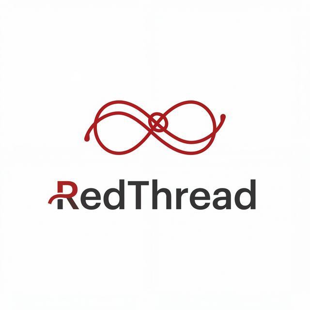

# RedThread 

  

  
  
  
  

---

**RedThread** is a Shopping Platform developed as a capstone project for **CS-470**. It represents a sophisticated blend of modern lifestyle aesthetics and robust backend Structure. Built with Laravel 8, RedThread provides a seamless, secure, and visually stunning journey from product discovery to final checkout.

## Core Pillars

- **Curated Experience**: A minimalist, dark-themed UI designed for premium retail.
- **Robust Engineering**: Built on Laravel 8 with a focus on clean code and maintainability.
- **Seamless Checkout**: An intuitive user journey optimized for conversion.
- **Architectural Integrity**: Featuring a decoupled frontend and a highly organized backend structure.

## Technical Foundation

RedThread leverages a modern stack to ensure scalability and performance:

- **Backend Logic**: PHP 8.1+ / Laravel 8
- **Frontend Interactivity**: Vue.js / Bootstrap 4
- **Asset Pipeline**: Laravel Mix / Webpack
- **Data Persistence**: SQLite (Development) / MySQL (Production)

## Deployment

To get RedThread running on your local machine for development or evaluation, please refer to the technical setup guide:

 **[Local Setup Guide](setup/guide.md)**

